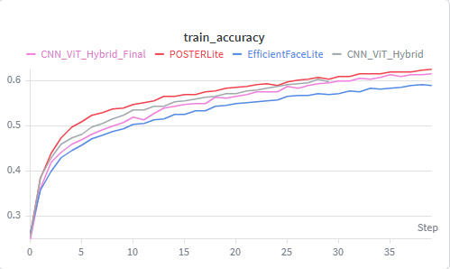
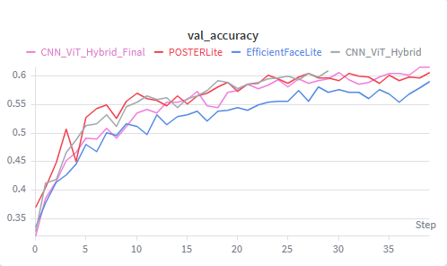
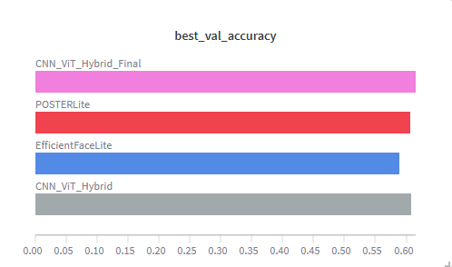
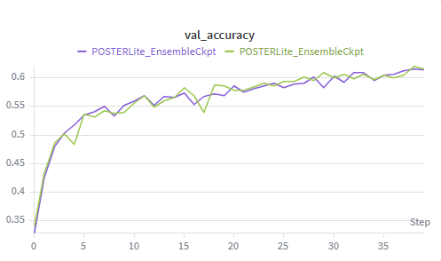

# Facial Expression Recognition (FER)

##  კონკურსის მიმოხილვა

[Kaggle FER Challenge](https://www.kaggle.com/competitions/challenges-in-representation-learning-facial-expression-recognition-challenge/) 

ამოცანა არის **7 კლასიანი კლასიფიკაცია - (Angry, Disgust, Fear, Happy, Sad, Surprise, Neutral)** 
გვაქვს 48×48 grayscale სურათები და დატა შეიცავს `pixels` სვეტსა და `emotion` label-ს.

**მთავარი მეტრიკა:** Accuracy

##  ჩემი მიდგომა

ნელ-ნელა, ნაბიჯ-ნაბიჯ ნეირონული ქსელის კომპლექსურობის გაზრდა და ამოცანაზე მორგება.
Baseline CNN -> უფრო ღრმა ქსელები -> რეგულარიზაცია (BatchNorm, Dropout, Augmentation) -> Attention მოდულები -> CNN+Transformer ჰიბრიდები -> Ensemble.


---

##  რეპოზიტორიის სტრუქტურა

```
ML-Assignment4/
├── model_experiment_CNN.ipynb              მოდელები 1–4 (Baseline, Deep, Optimal, Attention)
├── model_experiment_CNN_Transformer.ipynb  CNN+Transformer ჰიბრიდები + Ensemble
├── model_experiment_HP.ipynb               ჰიპერპარამეტრების ტუნინგი
├── README.md
└── data/
    ├── example_submission.csv   
    ├── train.csv                
    └── test.csv                 
```

> **დატა ფაილები GitHub-ზე ვერ ავტვირთე დიდი ზომის გამო და საჭიროების შემთხვევაში Kaggle-დან გადმოწერა მარტივი გზაა** (`train.csv` 240MB, `icml_face_data.csv` 300MB)

---

##  ფაილების აღწერა

| ფაილი | როლი |
|-------|-------------|
| **model_experiment_CNN.ipynb** | ძირითადი CNN ევოლუცია: 4 მოდელის განვითარების ფაილი |
| **model_experiment_CNN_Transformer.ipynb** | ტრანსფორმერდამატებული მოდელები: ViT/POSTER/EfficientFace ჰიბრიდები, checkpoint-ები, საბოლოო ensemble |
| **model_experiment_HP.ipynb** | ViT და POSTERLite-ის learning rate შედარება, ensemble წონების ძებნა |

---

##  მონაცემების მომზადება

###  Dataset და split

- **FERDataset** - CSV-დან 48×48 ტენზორების აწყობა, ნორმალიზაცია [0, 1].
- **Split:** 70% train / 15% validation / 15% test, `random_seed=42`.
- **Augmentation** (train-ზე): `RandomHorizontalFlip`, `RandomRotation(12°)`, `RandomAffine`.

###  კლასების დისბალანსი

Train-ზე ემოციები არათანაბრადაა განაწილებული (მაგალითად *Sad* ყველაზე ხშირია). 
ამის გამო გამოვთვალე `CLASS_WEIGHTS`, მაგრამ ViT-ზე class-weighted loss გაუარესდა (54% val), ამიტომ საბოლოო მოდელებში გამოვიყენე ჩვეულებრივი CrossEntropy.

---

##  Forward / Backward გადამოწმება

 სრული ტრენინგის წინ შესამოწმებლად ვიყენებ `sanity_check()`:

1. 1–2 სურათზე მოდელი **overfit**-ს აკეთებს (`loss.backward()` + `optimizer.step()`).
2. მოსალოდნელია loss დაახლოებით 0 და accuracy დაახლოებით 100%.

ეს ყველაფერი კი ამოწმებს, რომ forward და backward გრაფი სწორადაა დაკავშირებული და ოპტიმიზატორი მუშაობს. 
ფაილებში boolean-ით არის ჩართული (მაგ. `RUN_BASELINE_SANITY_CHECK`, `RUN_HYBRID_SANITY_CHECK`).

---

##  Training 

**Wandb პროექტი:** [CNN](https://wandb.ai/gsula22-free-university-of-tbilisi-/CNN)

### მოდელი 1 - BaselineCNN (`model_experiment_CNN.ipynb`)

დავიწყე ძალიან პრიმიტიული, პატარა არქიტექტურით, 2 conv ბლოკი, მინიმალური პარამეტრები, შედეგი, რა თქმა უნდა, არ იყო გადასარევი და ასეც უნდა ყოფილიყო.
მისი პრიმიტიულობის და გამო ჰქონდა underfit-ს პრობლმა, მაგრამ მაინც, ყოველი შემთხვევისთვის ვცადე სხვადასხვა ჰიპერპარამეტრებზე, იქნებ ჰიპერპარამეტრში იყო პრობლემა და არა კომპლექსურობაში და რა თქმა უნდა, ჰიპერპარამეტრის ტუნინგმა დიდი არაფერი შედეგი გამოიღო. მე-20 ეპოქის შემდეგ მოდელი აღარაფერს სწავლობდა, ანუ აშკარად ნიშანი იყო სიღრმის გაზრდის, ამიტომ გადავედი DeepCNN-ზე.


როგორც სურათებიდან ჩანს, გარკვეულ Learning Rate-ზე სხვადასხვა accuracy გვაქვს.
ყველაზე დაბალი შედეგი გვაქვს 0.0005 LR-ზე,  შედარებით მაღალი 0.01-ზე და საუკეთესო სტანდარტულ 0.001-ზე. მაგრამ ამ ყველაფრის მიუხედავად, მაინც უნდა გავაგრძელოთ მოდელის გაუმჯობესება, რადგან train-ზე accuracy დაახლოებით 60%-მდე გვქონდა და ვალიდაციაზე მაქსიმუმ 45%, რაც საკმაოდ ცუდი შედეგია.

---

### მოდელი 2 - DeepCNN (`model_experiment_CNN.ipynb`)

ზოგადი ლოგიკა ის იყო, რომ უფრო ღრმა ნეირონულ ქსელს უკეთ უნდა დაეჭირა რთული პატერნები დაუბალანსებელ დატაში. 
თუმცა, რა თქმა უნდა, ყველაფერი ასე მარტივად არ იყო ამ ამოცანაში.

დავტესტე სხვადასხვა მინი არქიტექტურები ღრმა CNN-ის (DeepCNN_Wide, DeepCNN_WideFC, DeepCNN_DeepNarrow) და სამივეს ერთი რამ ქონდათ საერთო, საშინელ -overfit-ში იყო მოდელი.


როგორც გრაფიკზეც ჩანს, train-ზე ჰქონდა accuracy 97-98 %, ვალიდაციაზე კი აჩვენებდა დაახლოებით 50%-ს, ანუ საშინელ overfit-ში იყო ჩვენი მოდელი და უბრალოდ CNN-ის სიღრმის გაზრდამ, რა თქმა უნდა, არ უშველა ჩვენს პრობლემას.

*აუცილებლად საჭირო იყო რეგულარიზაცია, რაც CNN-ის შემდეგ ეტაპზე გავაკეთე.*


---

### მოდელი 3 - OptimalCNN (`model_experiment_CNN.ipynb`)

 წინა მოდელის საშინელი overfit-ის შესამცირებლად ეტაპობრივად დავამატე:

1. **BatchNorm** (dropout=0)
2. **BatchNorm + Dropout**
3. **BN + Dropout + Augmentation** (საბოლოო ვარიანტი)


| ვარიანტი | საუკეთესო შედეგი ვალიდაციაზე |
|----------|----------|
| CNN_BatchNorm | 57.69% |


BatchNorm-მა საკმაოდ დიდი წვლილი შეიტანა მოდელის წინსვლაში, ამასთან ერთად Dropout-მა და Augmentation-მა ოდნავ კიდევ უფრო განავითარეს მოდელი, მაგრამ მაინც 60%-ზე დაბლა მერყეობს ამ მოდელების უმრავლესობა. მთავარი მიზეზი დატას დაუბალანსებლობაა, მაგრამ ასევე მოდელის კიდევ უფრო განვითარებაც არის შესაძლებელი.
ამის გამო, შემდეგ ეტაპზე გადავედი CNN + Attention-ზე.

---

### მოდელი 4 - CNN + Attention (`model_experiment_CNN.ipynb`)

OptimalCNN-ის შემდეგ მოდელი უკვე საკმაოდ სტაბილური იყო, მაგრამ 60%-ზე დაბალი რჩებოდა და ჩანდა, რომ მხოლოდ კონვოლუციის ბლოკებით უკვე ძნელი შემდეგი ნაბიჯის გაკეთება.
ამიტომ გადავწყვიტე, attention მოდულების დამატება, რომ ქსელს შეუძლებოდა მნიშვნელოვან feature-ებზე უფრო მკაფიოდ ფოკუსირება და ნაკლებად მნიშვნელოვან დეტალებზე ნაკლები ყურადღების დათმობა.

გავტესტე სამი attention ვარიანტი: SE, CBAM და ECA იგივე საბაზისო CNN-ზე, BatchNorm-ით, Dropout-ით და augmentation-ით, 40 Epoch-ის განმავლობაში. სამივე მათგანი OptimalCNN-ზე უკეთეს შედეგს აჩვენებდა, თუმცა ერთმანეთთან შედარებით განსხვავება არც ისეთი დიდი იყო.


  


| მოდული | საუკეთესო შედეგი ვალიდაციაზე |
|--------|----------|
| **SE** | **59.64%** |
| CBAM | 59.54% |
| ECA | 59.36% |


*უნდა აღვნიშნო*, რომ ეს შედეგები მივიღე 30 ეპოქაზე, 40 ეპოქაზე accuracy 61.5% ზე ადიოდა და უფრო მეტ ეპოქაზე ალბათ უკეთეს შედეგსაც აჩვენებდა.

გამარჯვებული SE Block გამოვიდა, რომელიც channel attention-ით აძლიერებს ყველაზე სასარგებლო სვეტებს. Attention-ზე მაინც არ გავჩერდი და როგორც კურსის განმავლობაში ვისწავლეთ, Transformer უფრო კაი ტიპია, ვიდრე მხოლოდ Attention, ამიტომ შემდეგ ეტაპზე გადავედი CNN + Transformer ჰიბრიდებზე.

---

### მოდელი 5 - CNN + Transformer ჰიბრიდები (`model_experiment_CNN_Transformer.ipynb`)

ემოციის ამოსაცნობად მხოლოდ ლოკალური feature-ები არ არის საკმარისი, სახის სხვადასხვა ნაწილებს შორის ურთიერთობაც მნიშვნელოვანია. 
ამისთვის Transformer კარგი ვარიანტი ჩანდა, რადგან ისინი ტოკენებს შორის გლობალურ კონტექსტს იჭერენ, ხოლო CNN კვლავ პასუხისმგებელია სივრცითი თვისებების ამოღებაზე.

ამ ეტაპზე სამი ჰიბრიდული არქიტექტურა შევადარე: ViT-სტილის `CNN_ViT_Hybrid`, POSTER-ის `POSTERLite` და `EfficientFaceLite`. სამივე CNN + Attention-ზე ოდნავ უკეთესად მუშაობდა, მაგრამ ერთმა მაინც აჯობა დანარჩენ ორს.






| მოდელი | საუკეთესო შედეგი ვალიდაციაზე |
|--------|------------|---------------------|
| **CNN_ViT_Hybrid** | **61.54%** |
| POSTERLite | 60.64% |
| EfficientFaceLite | 58.96% |



შედარების შემდეგ ძირითად ყურადღება ViT ჰიბრიდს მივაქციე. სხვადასხვა ჰიპერპარამეტრებზე ვცადე მოდელი, მაგრამ ან უარესდებოდა შედეგი, ან დაახლოებით იგივე რჩებოდა, წინ ვერ მივდიოდი.
საბოლოოდ `LR = 0.001` მოდელი დავტოვე და ბოლო გაშვებაზე ვალიდაციაზე **61.54%** და ტესტზე **59.23%** დადო. 

რადგან Attention-ს შემდეგ მინიმალური განვითარებაც კი ვერ დავინახე, გადავწყვიტე Ensemble მეთოდი მეცადა.
Ensemble-ში კი ViT-სა და  POSTERLite-ს გამოყენება გადავწყვიტე, **პირველ რიგში იმიტომ, რომ** სხვადასხვა ლოგიკით მუშაობენ, ანუ შეცდომების დამთხვევის ალბათობაც ნაკლები იქნებოდა და მათი გაერთიანებას კარგი შედეგი შეიძლება მოეცა და მეორე რიგში იმიტომ, რომ ViT-მ აქამდე საუკეთესო შედეგი მომცა და POSTERLite-მა საკმაოდ კარგი.

---

### მოდელი 6 - Ensemble (`model_experiment_CNN_Transformer.ipynb`)

ViT და POSTERLite ორი განსხვავებული არქიტექტურაა - ერთი Transformer-ზეა ორიენტირებული, მეორე კი multi-scale pyramid ლოგიკას იყენებს. 
პრაქტიკაში ეს ნიშნავს, რომ ისინი სხვადასხვა შეცდომებს აკეთებენ და ხშირად ერთად გაერთიანება უკეთეს შედეგს იძლევა, ვიდრე ნებისმიერი მათგანი ცალკე.

ამიტომ საბოლოო მოდელად ორივე ქსელის logit-ების თანაბარი საშუალო ავირჩიე: `ensemble_logits = (ViT_logits + POSTER_logits) / 2`. 
ორივე checkpoint იგივე learning rate-ით (`0.001`) იყო დატრენინგებული, რამაც წინა ექსპერიმენტებში საუკეთესო შედეგი მოგვცა.



| მოდელი | Test accuracy |
|--------|---------------|
| მხოლოდ ViT | 59.23% |
| **Ensemble ViT + POSTERLite** | **62.34%** |

**ეს შედეგი დადო 40 Epoch-ზე**

---

##  Hyperparameter tuning

**როგორც ვიცი, მსგავს ამოცანებში ჰიპერპარამეტრის გადარჩევას ნაკლები ყურადღება ექცევა და უმეტესად არქიტექტურაზე ჩალიჩი არის მთავარი ამოცანა, მაგრამ რადგან პირობაში ეწერა ჰიპერპარამეტრების გადარჩევა, მაინც დავუთმე რაღაც დრო.**
ჰიპერპარამეტრების ძებნა ცალკე ნოუთბუქში მიწერია (`model_experiment_HP.ipynb`). 
რადგან 30-40 ეპოქაზე გაშვებას საკმაოდ დიდი დრო მიჰქონდა, მოკლე, 15 ეპოქების ვალიდაციის accuracy-ით ვცადე ჰიპერპარამეტრების გადარჩევა, მაგრამ დიდი აზრი არ ჰქონია ამ ყველაფერს.

**BaselineCNN**

| LR | Best val |
|----|----------|
| 0.001 | 46.24% |
| 0.0005 | 43.89% |
| 0.01 | 39.29% |

*დასკვნა:* `0.01` ძალიან დიდია, `0.001` ოპტიმალურია Baseline-ისთვის.

**CNN_ViT_Hybrid**

| LR | Best val |
|----|------------------|
| 0.0005 | 57.20% |
| 0.001 | 55.41% |
| 0.002| 41.76% |


**POSTERLite**

| LR | Best val |
|----|------------------|
| 0.0005 | 57.29% |
| 0.001 | 56.83% |
| 0.002 | 54.55% |

ზუსტად იგივე ვითარებაა, რაც ViT-ზე.

---

##  Overfitting / Underfitting შეჯამება

|---------|----------|--------|
| **Overfitting** | DeepCNN: train 98%, val 53% | ღრმა ქსელი, არ არის BN/Dropout |
| **Underfitting (LR)** | Baseline `LR = 0.02`: val 39.29% | ზედმეტად დიდი learning rate |
| **Underfitting (LR)** | ViT/POSTER `LR = 0.002` : 42–54% val | ზედმეტად აგრესიული ნაბიჯი |
| **ცუდი სტრატეგია** | Class-weighted ViT: 54% val | ზედმეტი ყურადღება უმნიშვნელო კლასებზე |

---

##  Wandb Tracking

**პროექტი:** [CNN](https://wandb.ai/gsula22-free-university-of-tbilisi-/CNN)

**რადგან ყველა არქიტექტურა CNN-ს გარშემო იყო, ერთ ექსპერიმენტში დავლოგე ყველა და იმედია პრობლემა არ იქნება მაგის გამო.**
**ბევრი run კი დაგროვდა ერთ ექსპერიმენტში, მაგრამ Attention-ის ან ტრანსფორმერის დამატების გამო ახალი ექსპერიმენტის შექმნა უაზროდ ჩავთვალე.**

**თითოეულ run-ს თავისი სახელი აქვს, რომლიდანაც საკმაოდ მარტივია მოდელის ამოცნობა.**

თითოეულ run-ში ვინახავ: `epoch`, `train_loss`, `train_accuracy`, `val_loss`, `val_accuracy`, `best_val_accuracy`, `learning_rate`, `batch_size`, `model`.


---

##  საბოლოო მოდელის შერჩევა

**საბოლოო მოდელი:** **Ensemble - CNN_ViT_Hybrid + POSTERLite** (equal-weight logit average)

| მეტრიკა | მნიშვნელობა |
|---------|-------------|
| ViT val | 61.22% |
| POSTERLite val | 62.01% |
| **Ensemble test** | **62.34%** |

*(40 Epoch)*


**რატომ ensemble და არა მარტო ViT, ამაზე ზემოთ ტექსტშიც ვისაუბრე** 

Checkpoint-ები:  
`/kaggle/working/checkpoints/CNN_ViT_Hybrid.pt` და `POSTERLite.pt`  


---

##  მეტრიკების განმარტება

- **Validation accuracy** - HP შედარებისა და early stopping-ისთვის
- **Test accuracy** - საბოლოო შედეგი ანგარიშისთვის.
- **Train vs val gap** - overfit/underfit-ის მაჩვენებელი (განსაკუთრებით DeepCNN-ზე).

---

