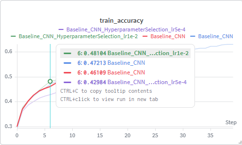
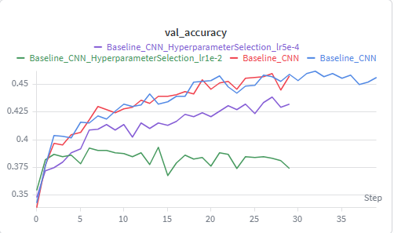
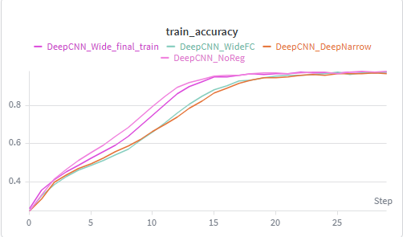
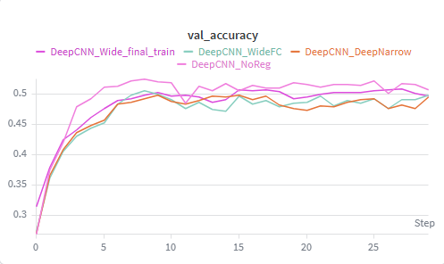
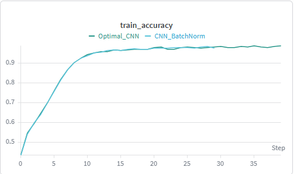
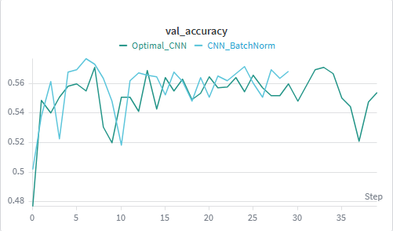
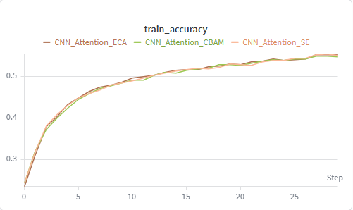
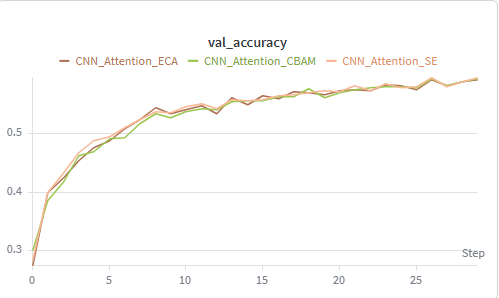
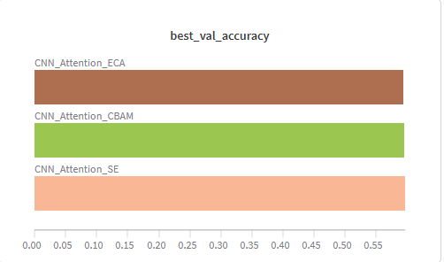

# Facial Expression Recognition (FER)

##  კონკურსის მიმოხილვა

[Kaggle FER Challenge](https://www.kaggle.com/competitions/challenges-in-representation-learning-facial-expression-recognition-challenge/) 

ამოცანა არის **7 კლასიანი კლასიფიკაცია - (Angry, Disgust, Fear, Happy, Sad, Surprise, Neutral)** 
გვაქვს 48×48 grayscale სურათები და დატა შეიცავს `pixels` სვეტსა და `emotion` label-ს.

**მთავარი მეტრიკა:** Accuracy

##  ჩემი მიდგომა

ნელ-ნელა, ნაბიჯ-ნაბიჯ ნეირონული ქსელის კომპლექსურობის გაზრდა და ამოცანაზე მორგება.
Baseline CNN -> უფრო ღრმა ქსელები -> რეგულარიზაცია (BatchNorm, Dropout, Augmentation) -> Attention მოდულები -> CNN+Transformer ჰიბრიდები -> Ensemble.


**Wandb პროექტი:** [CNN](https://wandb.ai/gsula22-free-university-of-tbilisi-/CNN)

---

##  რეპოზიტორიის სტრუქტურა

```
ML-Assignment4/
├── model_experiment_CNN.ipynb              მოდელები 1–4 (Baseline, Deep, Optimal, Attention)
├── model_experiment_CNN_Transformer.ipynb  CNN+Transformer ჰიბრიდები + Ensemble
├── model_experiment_HP.ipynb               ჰიპერპარამეტრების ტუნინგი
├── README.md
└── data/
    ├── example_submission.csv   
    ├── train.csv                
    └── test.csv                 
```

> **დატა ფაილები GitHub-ზე ვერ ავტვირთე დიდი ზომის გამო და საჭიროების შემთხვევაში Kaggle-დან გადმოწერა მარტივი გზაა** (`train.csv` 240MB, `icml_face_data.csv` 300MB)

---

##  ფაილების აღწერა

| ფაილი | როლი |
|-------|-------------|
| **model_experiment_CNN.ipynb** | ძირითადი CNN ევოლუცია: 4 მოდელის განვითარების ფაილი |
| **model_experiment_CNN_Transformer.ipynb** | ტრანსფორმერდამატებული მოდელები: ViT/POSTER/EfficientFace ჰიბრიდები, checkpoint-ები, საბოლოო ensemble |
| **model_experiment_HP.ipynb** | ViT და POSTERLite-ის learning rate შედარება, ensemble წონების ძებნა |

---

##  მონაცემების მომზადება

###  Dataset და split

- **FERDataset** - CSV-დან 48×48 ტენზორების აწყობა, ნორმალიზაცია [0, 1].
- **Split:** 70% train / 15% validation / 15% test, `random_seed=42`.
- **Augmentation** (train-ზე): `RandomHorizontalFlip`, `RandomRotation(12°)`, `RandomAffine`.

###  კლასების დისბალანსი

Train-ზე ემოციები არათანაბრადაა განაწილებული (მაგალითად *Sad* ყველაზე ხშირია). 
ამის გამო გამოვთვალე `CLASS_WEIGHTS`, მაგრამ ViT-ზე class-weighted loss გაუარესდა (54% val), ამიტომ საბოლოო მოდელებში გამოვიყენე ჩვეულებრივი CrossEntropy.

---

##  Forward / Backward გადამოწმება

 სრული ტრენინგის წინ შესამოწმებლად ვიყენებ `sanity_check()`:

1. 1–2 სურათზე მოდელი **overfit**-ს აკეთებს (`loss.backward()` + `optimizer.step()`).
2. მოსალოდნელია loss დაახლოებით 0 და accuracy დაახლოებით 100%.

ეს ყველაფერი კი ამოწმებს, რომ forward და backward გრაფი სწორადაა დაკავშირებული და ოპტიმიზატორი მუშაობს. 
ფაილებში boolean-ით არის ჩართული (მაგ. `RUN_BASELINE_SANITY_CHECK`, `RUN_HYBRID_SANITY_CHECK`).

---

##  Training 


### მოდელი 1 — BaselineCNN (`model_experiment_CNN.ipynb`)

დავიწყე ძალიან პრიმიტიული, პატარა არქიტექტურით, 2 conv ბლოკი, მინიმალური პარამეტრები, შედეგი, რა თქმა უნდა, არ იყო გადასარევი და ასეც უნდა ყოფილიყო.
მისი პრიმიტიულობის და გამო ჰქონდა underfit-ს პრობლმა, მაგრამ მაინც, ყოველი შემთხვევისთვის ვცადე სხვადასხვა ჰიპერპარამეტრებზე, იქნებ ჰიპერპარამეტრში იყო პრობლემა და არა კომპლექსურობაში და რა თქმა უნდა, ჰიპერპარამეტრის ტუნინგმა დიდი არაფერი შედეგი გამოიღო. მე-20 ეპოქის შემდეგ მოდელი აღარაფერს სწავლობდა, ანუ აშკარად ნიშანი იყო სიღრმის გაზრდის, ამიტომ გადავედი DeepCNN-ზე.





როგორც სურათებიდან ჩანს, გარკვეულ Learning Rate-ზე სხვადასხვა accuracy გვაქვს.
ყველაზე დაბალი შედეგი გვაქვს 0.0005 LR-ზე,  შედარებით მაღალი 0.01-ზე და საუკეთესო სტანდარტულ 0.001-ზე. მაგრამ ამ ყველაფრის მიუხედავად, მაინც უნდა გავაგრძელოთ მოდელის გაუმჯობესება, რადგან train-ზე accuracy დაახლოებით 60%-მდე გვქონდა და ვალიდაციაზე მაქსიმუმ 45%, რაც საკმაოდ ცუდი შედეგია.

---

### მოდელი 2 — DeepCNN (`model_experiment_CNN.ipynb`)

ზოგადი ლოგიკა ის იყო, რომ უფრო ღრმა ნეირონულ ქსელს უკეთ უნდა დაეჭირა რთული პატერნები დაუბალანსებელ დატაში. 
თუმცა, რა თქმა უნდა, ყველაფერი ასე მარტივად არ იყო ამ ამოცანაში.

დავტესტე სხვადასხვა მინი არქიტექტურები ღრმა CNN-ის (DeepCNN_Wide, DeepCNN_WideFC, DeepCNN_DeepNarrow) და სამივეს ერთი რამ ქონდათ საერთო, საშინელ -overfit-ში იყო მოდელი.





როგორც გრაფიკზეც ჩანს, train-ზე ჰქონდა accuracy 97-98 %, ვალიდაციაზე კი აჩვენებდა დაახლოებით 50%-ს, ანუ საშინელ overfit-ში იყო ჩვენი მოდელი და უბრალოდ CNN-ის სიღრმის გაზრდამ, რა თქმა უნდა, არ უშველა ჩვენს პრობლემას.

*აუცილებლად საჭირო იყო რეგულარიზაცია, რაც CNN-ის შემდეგ ეტაპზე გავაკეთე.*


---

### მოდელი 3 — OptimalCNN (`model_experiment_CNN.ipynb`)

 წინა მოდელის საშინელი overfit-ის შესამცირებლად ეტაპობრივად დავამატე:

1. **BatchNorm** (dropout=0)
2. **BatchNorm + Dropout**
3. **BN + Dropout + Augmentation** (საბოლოო ვარიანტი)


| ვარიანტი | საუკეთესო შედეგი ვალიდაციაზე |
|----------|----------|
| CNN_BatchNorm | 57.69% |






BatchNorm-მა საკმაოდ დიდი წვლილი შეიტანა მოდელის წინსვლაში, ამასთან ერთად Dropout-მა და Augmentation-მა ოდნავ კიდევ უფრო განავითარეს მოდელი, მაგრამ მაინც 60%-ზე დაბლა მერყეობს ამ მოდელების უმრავლესობა. მთავარი მიზეზი დატას დაუბალანსებლობაა, მაგრამ ასევე მოდელის კიდევ უფრო განვითარებაც არის შესაძლებელი.
ამის გამო, შემდეგ ეტაპზე გადავედი CNN + Attention-ზე.

---

### მოდელი 4 — CNN + Attention (`model_experiment_CNN.ipynb`)

OptimalCNN-ის შემდეგ მოდელი უკვე საკმაოდ სტაბილური იყო, მაგრამ 60%-ზე დაბალი რჩებოდა და ჩანდა, რომ მხოლოდ კონვოლუციის ბლოკებით უკვე ძნელი შემდეგი ნაბიჯის გაკეთება.
ამიტომ გადავწყვიტე, attention მოდულების დამატება, რომ ქსელს შეუძლებოდა მნიშვნელოვან feature-ებზე უფრო მკაფიოდ ფოკუსირება და ნაკლებად მნიშვნელოვან დეტალებზე ნაკლები ყურადღების დათმობა.

გავტესტე სამი attention ვარიანტი: SE, CBAM და ECA იგივე საბაზისო CNN-ზე, BatchNorm-ით, Dropout-ით და augmentation-ით, 40 Epoch-ის განმავლობაში. სამივე მათგანი OptimalCNN-ზე უკეთეს შედეგს აჩვენებდა, თუმცა ერთმანეთთან შედარებით განსხვავება არც ისეთი დიდი იყო.



   


| მოდული | საუკეთესო შედეგი ვალიდაციაზე |
|--------|----------|
| **SE** | **59.64%** |
| CBAM | 59.54% |
| ECA | 59.36% |

გამარჯვებული SE Block გამოვიდა, რომელიც channel attention-ით აძლიერებს ყველაზე სასარგებლო ფიჩერებს. მიუხედავად ამისა, მაინც ვგრძნობდი, რომ მხოლოდ ლოკალური attention უკვე არასაკმარისი იყო და FER-ისთვის საჭირო იყო უფრო გლობალური კონტექსტის დაჭერა, ამიტომ შემდეგ ეტაპზე გადავედი CNN + Transformer ჰიბრიდებზე.

---

### მოდელი 5 — CNN + Transformer ჰიბრიდები (`model_experiment_CNN_Transformer.ipynb`)

FER-ში ემოციის ამოსაცნობად მხოლოდ ლოკალური ფიჩერები არ არის საკმარისი — სახის სხვადასხვა ნაწილებს შორის ურთიერთობაც მნიშვნელოვანია. ამისთვის Transformer-ის ტიპის ბლოკები კარგი კომპრომისი ჩანდა, რადგან ისინი ტოკენებს შორის გლობალურ კონტექსტს იჭერენ, ხოლო CNN კვლავ პასუხისმგებელია სივრცითი ფიჩერების ამოღებაზე.

ამ ეტაპზე სამი ჰიბრიდული არქიტექტურა შევადარე — ViT-სტილის `CNN_ViT_Hybrid`, POSTER-ის პირამიდული `POSTERLite` და `EfficientFaceLite`. სამივე CNN + Attention-ზე უკეთესად მუშაობდა, თუმცა ერთმანეთთან შედარებით სხვადასხვა პრიორიტეტს აჩვენებდნენ.

| მოდელი | ინსპირაცია | საუკეთესო შედეგი ვალიდაციაზე |
|--------|------------|---------------------|
| **CNN_ViT_Hybrid** | ViT-სტილი | **60.85%** (30 ep) |
| POSTERLite | POSTER pyramid | 60.64% (40 ep) |
| EfficientFaceLite | EfficientFace | 58.96% (40 ep) |

შედარების შემდეგ ძირითად ყურადღება ViT ჰიბრიდს მივაქციე და 40 ეპოქით, `lr=1e-3`-ით საბოლოო გაშვება ჩავატარე. ამ ვერსიამ ვალიდაციაზე **61.22%** და ტესტზე **59.23%** აჩვენა. POSTERLite-მაც ძლიერი შედეგი მოგვცა და ეს უკვე ensemble-ისთვის კარგი საფუძველი გამოჩნდა.

---

### მოდელი 6 — Ensemble (`model_experiment_CNN_Transformer.ipynb`)

ViT და POSTERLite ორი განსხვავებული არქიტექტურაა — ერთი Transformer-ზეა ორიენტირებული, მეორე კი multi-scale pyramid ლოგიკას იყენებს. პრაქტიკაში ეს ნიშნავს, რომ ისინი სხვადასხვა შეცდომებს აკეთებენ და ხშირად ერთად გაერთიანება უკეთეს შედეგს იძლევა, ვიდრე ნებისმიერი მათგანი ცალკე.

ამიტომ საბოლოო მოდელად ორივე ქსელის logit-ების თანაბარი საშუალო ავირჩიე: `ensemble_logits = (ViT_logits + POSTER_logits) / 2`. ორივე checkpoint იგივე learning rate-ით (`1e-3`) იყო ნატრენინგი, რაც წინა ექსპერიმენტებში საუკეთესო ensemble შედეგს მოგვცა.

| მოდელი | Test accuracy |
|--------|---------------|
| ViT მარტივად (lr=1e-3) | 59.23% |
| **Ensemble ViT + POSTERLite** | **62.15%** |

Ensemble-მა ViT-ზე დაახლოებით 3 პუნქტით გააუმჯობესა შედეგი და პროექტის საუკეთესო test accuracy **62.15%** გახდა (`Ensemble_ViT_POSTERLite_FinalTest` run Wandb-ში).

---

##  Hyperparameter tuning

ჰიპერპარამეტრების ძებნა ცალკე ნოუთბუქშია (`model_experiment_HP.ipynb`) — **15 ეპოქიანი მოკლე გაშვებები**, val-ით შედარება (სრული 40 ep-ის ნაცვლად).

### BaselineCNN — learning rate (`model_experiment_CNN.ipynb`)

| LR | Best val |
|----|----------|
| **1e-3** | **46.24%** |
| 5e-4 | 43.89% |
| 1e-2 | 39.29% |

**დასკვნა:** `1e-2` ძალიან დიდია → **underfitting/არასტაბილური სწავლა**; `1e-3` ოპტიმალურია Baseline-ისთვის.

### CNN_ViT_Hybrid — learning rate (15 ep)

| LR | Best val @ 15 ep |
|----|------------------|
| **5e-4** | **57.20%** |
| 1e-3 | 55.41% |
| 2e-3 | 41.76% |

**დასკვნა:** `2e-3` უარყოფითი; `5e-4` სწრაფად სწავლობს, მაგრამ **40 ep სრულ ensemble-ზე საუკეთესო დარჩა `lr=1e-3`** (62.15% test).

### POSTERLite — learning rate (15 ep)

| LR | Best val @ 15 ep |
|----|------------------|
| **5e-4** | **57.29%** |
| 1e-3 | 56.83% |
| 2e-3 | 54.55% |

იგივე ტენდენცია, რაც ViT-ზე.

---

##  Overfitting / Underfitting — მნიშვნელოვანი მაგალითები

ლექტორი ამბობს, რომ overfit/underfit მოდელების ანალიზი უფრო მნიშვნელოვანია, ვიდრე მხოლოდ მაღალი ქულა.

| მოვლენა | მაგალითი | მიზეზი |
|---------|----------|--------|
| **Overfitting** | DeepCNN: train ~98%, val ~53% | ღრმა ქსელი, არ არის BN/Dropout |
| **Underfitting (LR)** | Baseline `lr=1e-2`: val 39.29% | ზედმეტად დიდი learning rate |
| **Underfitting (LR)** | ViT/POSTER `lr=2e-3` @ 15 ep: ~42–54% val | ზედმეტად აგრესიული ნაბიჯი |
| **ცუდი სტრატეგია** | Class-weighted ViT: ~54% val | ძალით over-emphasis ნაკლებ კლასებზე |
| **Ensemble არ ყოველთვის უკეთესი** | lr5e-4 ViT + POSTER: ensemble 61.16% < ViT alone 61.25% | მოდელები ძალიან მსგავს შეცდომებს აკეთებენ |

---

##  Wandb Tracking

**პროექტი:** [CNN](https://wandb.ai/gsula22-free-university-of-tbilisi-/CNN)

MLflow-ის მსგავსად, **თითოეული არქიტექტურა/ექსპერიმენტი ცალკე run-ია**, მაგალითად:

- `Baseline_CNN`, `Baseline_CNN_HyperparameterSelection_lr*`
- `DeepCNN_Wide`, `DeepCNN_WideFC`, `DeepCNN_DeepNarrow`
- `CNN_BatchNorm`, `OptimalCNN_*`
- `SE`, `CBAM`, `ECA`
- `CNN_ViT_Hybrid`, `POSTERLite`, `EfficientFaceLite`
- `CNN_ViT_Hybrid_Final`, `POSTERLite_EnsembleCkpt`
- `ViT_HP_lr5e-4`, `ViT_HP_lr2e-3`, `POSTER_HP_lr5e-4`, `POSTER_HP_lr2e-3`
- `Ensemble_ViT_POSTERLite_FinalTest`

თითო run-ში ლოგირდება: `epoch`, `train_loss`, `train_accuracy`, `val_loss`, `val_accuracy`, `best_val_accuracy`, კონფიგი (`learning_rate`, `batch_size`, `model`, და ა.შ.).

**ბონუსი:** Wandb Report-ის შექმნა რეკომენდებულია (ჯგუფები: CNN ევოლუცია / Hybrid / HP / Ensemble).

---

##  საბოლოო მოდელის შერჩევა

**საბოლოო მოდელი:** **Ensemble — CNN_ViT_Hybrid + POSTERLite** (equal-weight logit average)

| მეტრიკა | მნიშვნელობა |
|---------|-------------|
| Learning rate (ორივე) | **1e-3** |
| ViT val (40 ep) | 61.22% |
| ViT test | 59.23% |
| POSTERLite val | 62.01% |
| **Ensemble test** | **62.15%** |

**რატომ ensemble და არა მარტო ViT:** ensemble +2.9 პუნქტით აღემატება ViT-ს test-ზე; POSTERLite სხვა არქიტექტურული ხედვაა (multi-scale pyramid).

**რატომ არა `lr=5e-4`:** 15-ep HP-ში უკეთესი იყო, მაგრამ 40-ep + ensemble სესიაში `1e-3` მოგვცა უმაღლესი ensemble test.

Checkpoint-ები (იმავე Kaggle სესიაში):  
`/kaggle/working/checkpoints/CNN_ViT_Hybrid.pt` და `POSTERLite.pt`  
→ **Save Version → Save output** რეკომენდებულია.

---

##  მეტრიკების განმარტება

- **Validation accuracy** — HP შედარებისა და early stopping-ისთვის; test-ზე ერთხელ ვაფასებთ საბოლოოს.
- **Test accuracy** — held-out 15% split (seed=42); საბოლოო რიცხვი ანგარიშისთვის.
- **Train vs val gap** — overfitting-ის ინდიკატორი (განსაკუთრებით DeepCNN-ზე).

---

##  როგორ გავუშვათ (Kaggle)

1. **CNN ევოლუცია:** `model_experiment_CNN.ipynb` — toggle-ები თითო მოდელისთვის (`RUN_* = False` დასრულებული ექსპერიმენტებისთვის).
2. **Transformer + Ensemble:** `model_experiment_CNN_Transformer.ipynb`  
   - საბოლოო ensemble უკვე ჩაწერილია; training toggle-ები **False** (არ გაუშვათ Run All შემთხვევით).
3. **HP:** `model_experiment_HP.ipynb` — `RUN_VIT_LR_SEARCH` / `RUN_POSTER_LR_SEARCH` (დასრულებული); ensemble weight search საჭიროებს checkpoint-ებს.
4. **Wandb:** `WANDB_API_KEY` Kaggle Secrets-ში.

---

##  ბმულები

- **Wandb პროექტი:** https://wandb.ai/gsula22-free-university-of-tbilisi-/CNN
- **Kaggle კონკურსი:** https://www.kaggle.com/competitions/challenges-in-representation-learning-facial-expression-recognition-challenge/

---

##  შეჯამება

| კრიტერიუმი | რა გავაკეთე |
|------------|-------------|
| **≥3 არქიტექტურა** | Baseline, Deep (3), Optimal, Attention (3), Hybrid (3), Ensemble |
| **იტერაციული განვითარება** | ფენობრივად დავამატე სიღრმე, რეგულარიზაცია, attention, transformer |
| **HP tuning** | LR Baseline, ViT, POSTER; არქიტექტურული შედარებები |
| **Forward/backward** | `sanity_check()` ყველა ოჯახში |
| **Over/underfit ანალიზი** | DeepCNN overfit, LR ექსტრემუმები, class weights ჩავარდნა |
| **Wandb** | ცალკე run თითო ექსპერიმენტზე |
| **საუკეთესო შედეგი** | Ensemble test **62.15%** |
